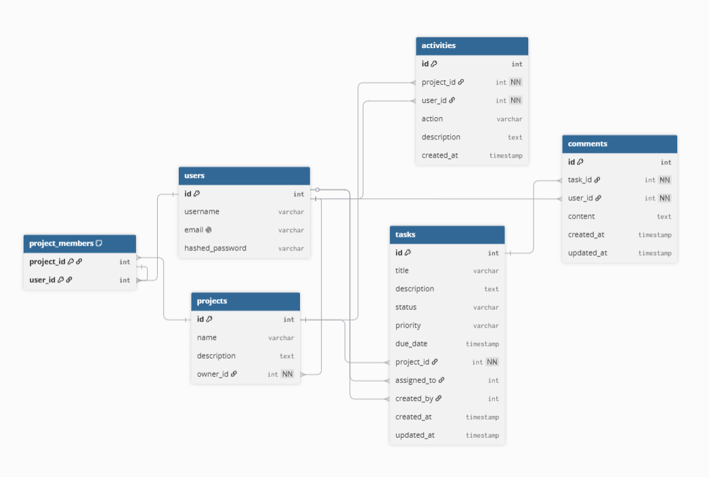

# Task Manager API

A production-inspired Task Management REST API built with FastAPI, SQLAlchemy, MySQL, Alembic, and JWT Authentication.
The project demonstrates authentication, role-based project management, task assignment, activity tracking, comments, database migrations, Docker support, and RESTful API design.

## Features

-  JWT Authentication
-  User Registration & Login
-  Project Management
-  Project Membership
-  Task Assignment
-  Task Priorities & Status
-  Task Comments
-  Activity Logging
-  Role-based Authorization
-  Alembic Database Migrations
-  MySQL Database
-  Docker Support
-  Interactive Swagger Documentation

## Project Architecture

- One User owns many Projects.
- One project can Contain many Users.
- Projects contain multiple Tasks.
- Users can belong to multiple Projects.
- Tasks can have multiple Comments.
- User and Projects maintain an Activity Log.

